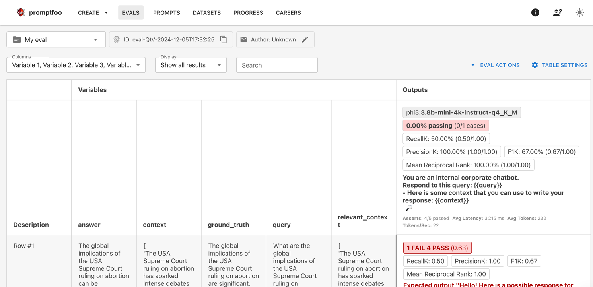
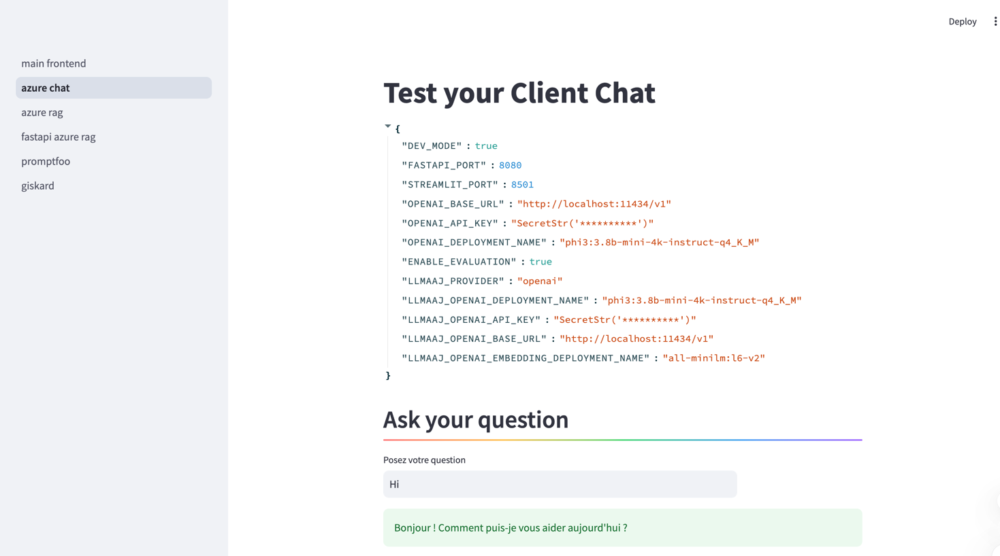

<h1>Generative AI Project Template</h1>


[](https://www.python.org/downloads/release/python-3110/)
[](https://www.debian.org/)
[](#)

[](#)
[](https://pytorch.org/get-started/locally/)
[](#)

[](#)
[](#)

[](https://github.com/charliermarsh/ruff)
[](#)
[]()
[](#)
[](#)
[](#)

Template for a new AI Cloud project.

Click on [<kbd>Use this template</kbd>](https://github.com/aminedjeghri/ai-cloud-project-template/generate) to start your own project!


This project is a generative ai template. It contains the following features: LLMs, information extraction, chat, rag & evaluation.
It uses LLMs(local or cloud),streamlit (with and without fastapi) & Promptfoo as an evaluation and redteam framework for your AI system.

| Evaluation with promptfoo                            | Streamlit                                            |
|------------------------------------------------------|------------------------------------------------------|
|  |  |

**Engineering tools:**

- [x] Use UV to manage packages
- [x] pre-commit hooks: use ``ruff`` to ensure the code quality & ``detect-secrets`` to scan the secrets in the code.
- [x] Logging using loguru (with colors)
- [x] Pytest for unit tests
- [x] Dockerized project (Dockerfile & docker-compose): for the evaluation pipeline.
- [x] Streamlit (frontend) & FastAPI (backend)
- [x] Make commands to handle everything for you: install, run, test

**AI tools:**

- [x] LLM running locally (Ollama & Ollamazure) or in the cloud (OpenAI & Azure OpenAI)
- [x] Information extraction and Question answering from documents
- [x] Chat to test the AI system
- [x] Efficient async code using asyncio.
- [x] AI Evaluation framework: using Promptfoo, Ragas & more...

**CI/CD & Maintenance tools:**

- [x] CI/CD pipelines: ``.github/workflows`` for GitHub and ``.gitlab-ci.yml`` for GitLab
- [x] Local CI/CD pipelines: GitHub Actions using ``github act`` and local GitLab CI using ``gitlab-ci-local``

**Documentation tools:**

- [x] Wiki creation and setup of documentation website using Mkdocs
- [x] GitHub Pages deployment using mkdocs gh-deploy plugin


Upcoming features:

- [ ] optimize caching in CI/CD
- [ ] [Pull requests templates](https://docs.github.com/en/communities/using-templates-to-encourage-useful-issues-and-pull-requests/creating-a-pull-request-template-for-your-repository)
- [ ] Additional MLOps templates: https://github.com/fmind/mlops-python-package
- [ ] Add MLFlow
- [ ] add Langfuse
- [ ] deploy gh pages in actions

## 1. Getting started
This project contains two parts:

- The AI app: contains an AI system (local or cloud), a frontend (streamlit), with an optional backend(fastapi).
- (optional)The Evaluation Tool: The evaluation tool is used to evaluate the performance and safety of the AI system. It uses promptfoo & RAGAS, Python 3.11 and NVM are needed, but no need to install them by yourself since the project will handle that for you.

The following files are used in the contribution pipeline:

- ``.env.example``: example of the .env file.
- ``.env`` : contains the environment variables used by the app.
- ``Makefile``: contains the commands to run the app locally.
- ``Dockerfile``: the dockerfile used to build the docker image. It uses the Makefile commands to run the app.
- ``.pre-commit-config.yaml``: pre-commit hooks configuration file
- ``pyproject.toml``: contains the pytest, ruff & other configurations.
- ``log_config.py``: logging configuration file for the project. This logger is used in the backend and can be used in
  the frontend.
- .github/workflows/**.yml: GitHub actions configuration files.
- .gitlab-ci.yml: Gitlab CI configuration files.


### 1.1. Local Prerequisites

- Ubuntu 22.04 or MacOS
- git clone the repository
- UV & Python 3.11 (will be installed by the Makefile)
- Create a ``.env`` file *(take a look at the ``.env.example`` file)*


### ⚙️ Steps for Installation (Users)
#### App (AI, FastAPI, Streamlit)

1. To install the app, run `make install-prod`.
2. Choose one of the following options:
   - Local model: we use Ollama that simulates OpenAI or Azure OpenAI. The model that is used is `phi3:3.8b-mini-4k-instruct-q4_K_M` but can be changed.
     - Read about how the app handles different providers and how to emulate OpenAI if you use open source models.
     - Update the ``.env`` file *(take a look at the ``.env.example`` file)*
     - Install Ollama (for openai) `make install-ollama` or ollamazure (for azure)
     - Download the model, run `make download-ollama-model`. It will download the model present in the `OLLAMA_MODEL_NAME` var in the ``.env`` file.
     - Run ollama to emulate openai : `make run-ollama` or ollamazure to emulate azure openai : `make run-ollamazure`
     - Run `make test-ollama`. You should see an output with a response.
   - Or Cloud model: OpenAI or Azure OpenAI:
     - Update the ``.env`` file *(take a look at the ``.env.example`` file)*

3. Run `test-llm-client` to check if your the LLM responds.
4. Run the app:
- To run the app with Streamlit (and without fastapi), run `make run-frontend`
- To run the app with both Streamlit and FastAPI, run `make run-app`

#### (optional) Evaluation Tool (AI, Promptfoo, RAGAS)

- To install the evaluation tool, run `make install-promptfoo` (nvm, promptfoo ...),
- We will use the name `LLMAAJ` to refer to LLM_AS_A_JUDGE, which is used to evaluate the AI system in Ragas metrics and other metrics
- Update the ``.env`` file *(take a look at the ``.env.example`` file)*
- To run the app, run `make eval-env-file`

**How to run the evaluations locally:**

- You can run promptfoo with ```make eval-env-file``` to run the evaluation reading the env file. take a look at promptfoo section in the ``.env.example`` file, if you want to use similarity metrics, you need to add the embedding model.
- Run `test-llmaaj-client` to check if the LLM as a judge responds.
- If you check the ``make eval-env-file`` command in the makefile, you can see that we do cd src and then set the python path to the current directory so promptfoo can find it.
- You need to be familiar with Promptfoo to use it. I advise you to learn about it before making changes to the evaluations part of this repository.
For now, there are different datasets and configs:
- a simple dataset
- a dataset for information extraction (NER). IE metrics will be also computed on this dataset.
- if you want to change a config, go to the makefile and look at the ``eval-env-file`` command. Change the --config evaluation/promptfooconfig.yaml to other configs

Steps to evaluate a rag system:

**retrieval metrics :evaluating retrieved contexts against ground truth**:

1. dataset :
   - Each row of a dataset has a query and an answer.
2. steps and metrics:
   - Evaluate the chunking (chunk_size & chunk_overlap): you will need to check the context_recall & precision for example to see if the answer is in the context.
   - Evaluate the embeddings: (try different models): same as previous
   - try retrieval systems like Azure AI Search: same as previous

**end-task: evaluating ground truth vs generated answer**:

1. dataset :
   - Depending on the end task and the type of the answer (string, or json...), you will need to build the dataset on that.
   - For example, if the answer is a string, the dataset column 'answer' will be a string.
   - if you are going to evaluate batch of questions and batch of answers, you will need to build the dataset on that.

2. steps and metrics:
   - For example, if the answer is a string, you will need to use the exact_match & ragas answer_similarity.
   - If the answer is a json, you will need to use the json_exact_match, missing_fields...
   - Changing the prompt
   - Using one question, or multiple questions (batch) at once sent to the LLM.

3. promptfoo config:
   - If you use a config like the one in ``src/evaluation/providers/config_baseline.py``, we use an abstract class to define the global structure.
   - Be aware that you need to adapt it if you want to use it for something else.

## Docker installation (deprecated, will be updated soon)

[//]: # (todo update docker installation for the app and for promptfoo)
- Set the environment variables (in the system or in a .env file)
- Run docker with the right port bindings.
- Since the app is running in docker and using streamlit, the Internal and External URL addresses won't work. You need to access the app with localhost:forwarded_port

### ⚙️ Steps for Installation (Contributors and maintainers)
Check the [CONTRIBUTING.md](CONTRIBUTING.md) file for more information.

## Contributing
Check the [CONTRIBUTING.md](CONTRIBUTING.md) file for more information.
